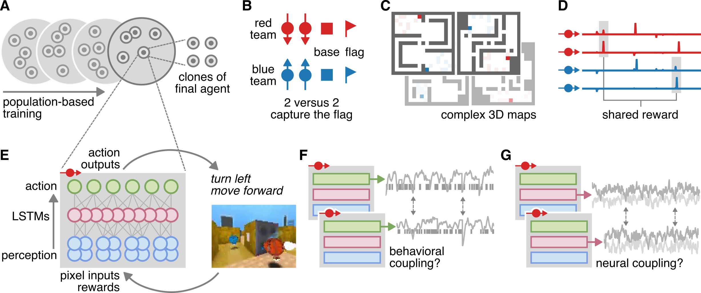

# Emergent brain-to-brain coupling and cooperative behavior in an artificial gameplay ecosystem
This repository accompanies a manuscript in preparation by Samuel A. Nastase and Luke Marris examining brain-to-brain coupling and cooperative behavior in deep reinforcement learning agents playing capture the flag.

*Correspondence:* Samuel A. Nastase ([sam.nastase@gmail.com](mailto:sam.nastase@gmail.com))

---

---

This repository contains scripts and notebooks for exploring, analyzing, and visualizing the data. The following list of scripts are used to conduct the main analyses and produce the figures in the text (roughly in orer of execution):

* Run PCA to reduce the dimensionality of the LSTM activity space: [`lstm_pca.py`](https://github.com/snastase/social-ctf/blob/master/lstm_pca.py); run PCA on $N - 1$ training maps and apply to left-out test map for cross-validated prediction models: [`lstm_cvpca.py`](https://github.com/snastase/social-ctf/blob/master/lstm_cvpca.py), [`lstm_cvpca.sh`](https://github.com/snastase/social-ctf/blob/master/lstm_cvpca.sh) (**Fig. 2**)

* Visualize and compare cooperative (within-team) and competitive (across-team) ISCs: [`cooperative_isc.py`](https://github.com/snastase/social-ctf/blob/master/cooperative_isc.py) (**Fig. 2**)

* Confound regression to orthogonalize LSTM activity from perceptual inputs when computing ISC: [`confound_regression.py`](https://github.com/snastase/social-ctf/blob/master/confound_regression.py) (**Fig. 2**)

* Compute and compare different statistical pairwise interaction (SPI) metrics: [`compute_spis.py`](https://github.com/snastase/social-ctf/blob/master/compute_spis.py), [`compute_spis.sh`](https://github.com/snastase/social-ctf/blob/master/compute_spis.sh), [`compare_spis.py`](https://github.com/snastase/social-ctf/blob/master/compare_spis.py)

* Predict match structure and outcomes from ISC/coupling values using regression and classification cross-validated to left-out maps: [`decode_outcome.ipynb`](https://github.com/snastase/social-ctf/blob/master/decode_outcome.ipynb)

* Construct intersubject neural encoding models to predict target agent's LSTM activity from the teammate and opponents LSTM activity; isolate unique variance explained by teammate LSTMs: [`intersubject_encoding.py`](https://github.com/snastase/social-ctf/blob/master/intersubject_encoding.ipynb) (**Fig. 3**)

* Construct behavioral encoding models to predict target agent's LSTM activity from the teammate's, opponents', and agent's own behavior; isolate unique variance explained by teammate behavior: [`behavior_encoding.py`](https://github.com/snastase/social-ctf/blob/master/behavior_encoding.py) (**Fig. 4**)

* Construct cross-validated Granger-causal regression model to test whether teammate'avs behavior predict's target agent's future behavior; explore whether target agent's LSTM activity mediates the relationship between teammate behavior and target agent's future behavior: [`mediation_teammate.py`](https://github.com/snastase/social-ctf/blob/master/mediation_teammate.ipynb)

* Define behavior heuristics and compose them into cooperative behaviors; explore and visualize different cooperative behaviors: [`behavior_heuristics.py`](https://github.com/snastase/social-ctf/blob/master/behavior_heuristics.py), [`cooperative_behavior.ipynb`](https://github.com/snastase/social-ctf/blob/master/cooperative_behavior.ipynb) (**Fig. 5**, **Table 1**)

* Compute dynamic, inter-agent cofluctuation during both actual behavior events and matched null events: [`iscf_behavior_on-off_rms.py`](https://github.com/snastase/social-ctf/blob/master/iscf_behavior_on-off_rms.py), [`iscf_behavior-on_rms.sh`](https://github.com/snastase/social-ctf/blob/master/iscf_behavior-on_rms.sh), [`iscf_behavior-off_rms.sh`](https://github.com/snastase/social-ctf/blob/master/iscf_behavior-off_rms.sh), [`isfc_behav-cov.py`](https://github.com/snastase/social-ctf/blob/master/isfc_behav-cov.py), [`isfc_behav-cov.sh`](https://github.com/snastase/social-ctf/blob/master/isfc_behav-cov.sh) (**Fig. 6**)

* Visualize value and coupling during behavior events compared to matched null events: [`plot_coupling.ipynb`](https://github.com/snastase/social-ctf/blob/master/plot_coupling.ipynb) (**Fig. 6**)

* Classify cooperative behaviors based on dynamic inter-agent cofluctuation across all pairs of LSTM PCs: [`behavior_decoding.py`](https://github.com/snastase/social-ctf/blob/master/behavior_decoding.py) (**Fig. 6**)

* Run t-SNE embedding on LSTM activity and plot cooperative behavior events: [`andrew/tsne_slurm.py`](https://github.com/snastase/social-ctf/blob/master/andrew/tsne_slurm.py), [`andrew/tsne_slurm.sh`](https://github.com/snastase/social-ctf/blob/master/andrew/tsne_slurm.sh), [`plot_tsne.ipynb`](https://github.com/snastase/social-ctf/blob/master/plot_tsne.ipynb) (**Fig. 6**)

Certain utility functions are also imported from separate files: [`coupling_metrics.py`](https://github.com/snastase/social-ctf/blob/master/coupling_metrics.py), [`statistical_tests.py`](https://github.com/snastase/social-ctf/blob/master/statistical_tests.py)

We provide YAML files generated by conda for installing the software environment/versions used for this project: [`environment_2021-09-14.yml`](https://github.com/snastase/social-ctf/blob/master/environment_2021-09-14.yml), [`environment-flexible_2021-09-14.yml`](https://github.com/snastase/social-ctf/blob/master/environment-flexible_2021-09-14.yml)

Exploratory analyses performed by research assistants Andrew Goldberg and Victoria Graf at Princeton University are included in the [`andrew/`](https://github.com/snastase/social-ctf/tree/master/andrew) and [`victoria/`](https://github.com/snastase/social-ctf/tree/master/victoria) directories. Other exploratory and unfinished scripts are included in the [`sandbox/`](https://github.com/snastase/social-ctf/tree/master/sandbox) directory.
